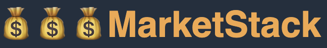
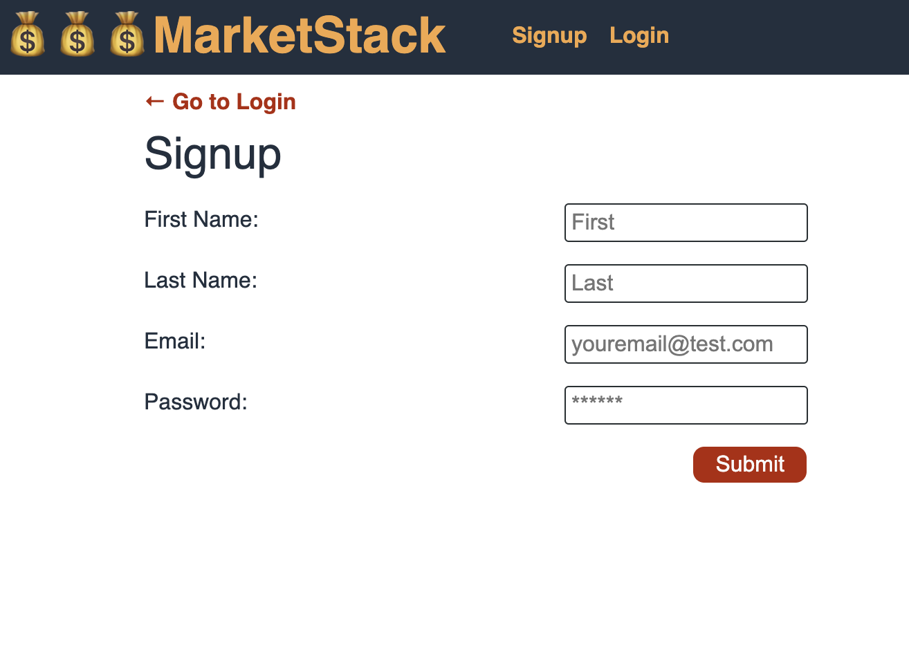
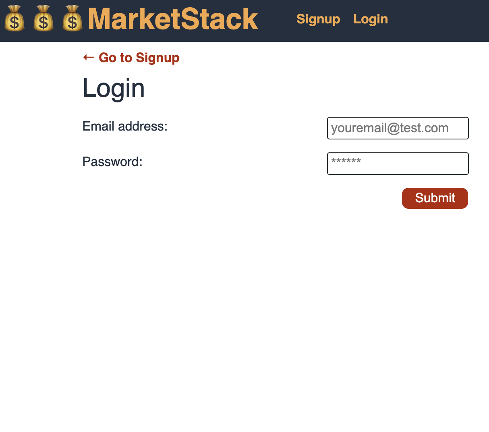
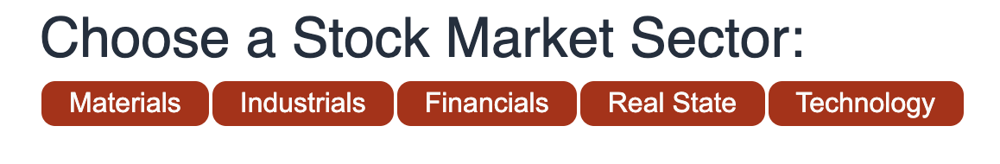
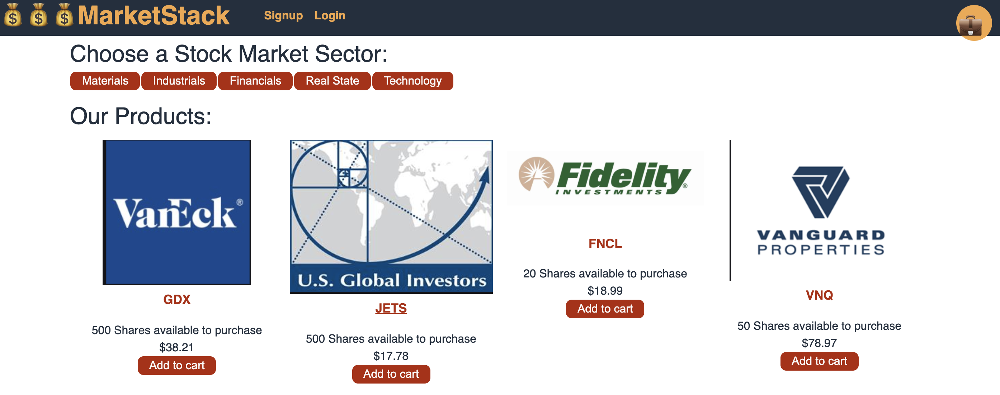

# 

## Description 

This application was created for all those who get up every morning and want to see how the stock market is. The application is designed so that we can navigate through all those investments that are being run at that moment, we can also select each of them to add them to our Portfolio cart to be able to buy those shares, the shopping cart will have all the shares we want buy until we decide to make our payment of all the shares that we have in cart at that time, we can also add and delete at the time we want. We can also select our actions by sectors so that we can go to a specific type of sector. In the future we want to make improvements to be able to unite all the actions and that the changes are seen through graphics and live screens.

## Table of Contents

- [Installation](#installation)
- [Usage](#usage)
- [Contributing](#contributing)
- [Tests](#tests)
- [License](#license)
- [Deployed Application](#Deployed-Application)
- [ScreenShots](screen-shot)
- [Questions](#questions)

## Installation

Clone this repository and run `npm i` to download and install the dependencies. To initialize the database run "npm run seed" to feed the database
## Usage 

After installing start the server by running `npm start`.

## Contributing

Pull requests are welcome. For major changes, please open an issue first to discuss what you would like to change.

Please make sure to update tests as appropriate.

## Tests

## Deployed Application

[MarketStack]()

## Screen-Shots

## Questions

Contact us:

* Email: marioviana07@gmail.com
* Github: www.github.com/marioviana07
* Email: Maximoabahamondes@gmail.com
* Github: www.github.com/Maximo100100
* Email: armydavidconsulting@gmail.com
* Github: 
* Email: tarahmcelyea@gmail.com
* Github: www.github.com/tmcelyea93